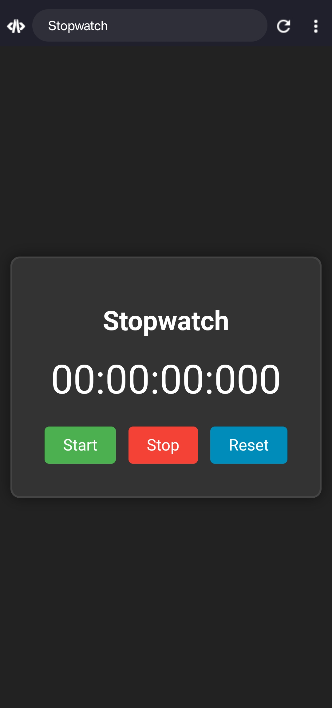

# Stopwatch Project  
A simple stopwatch built using HTML, CSS, and JavaScript.

## 🕒 Features  
- Start, Stop, and Reset buttons  
- Displays hours, minutes, seconds, and milliseconds  

## 📸 Screenshots  
### 1. Stopwatch Interface  

## 🚀 How to Use  
1. **Clone the repository:**
https://github.com/mauryamj/Sopwatch-project
2. **Open `sw.html`** in your browser.

## 👨‍💻 Author  
**Abhishek Maurya**  

---
